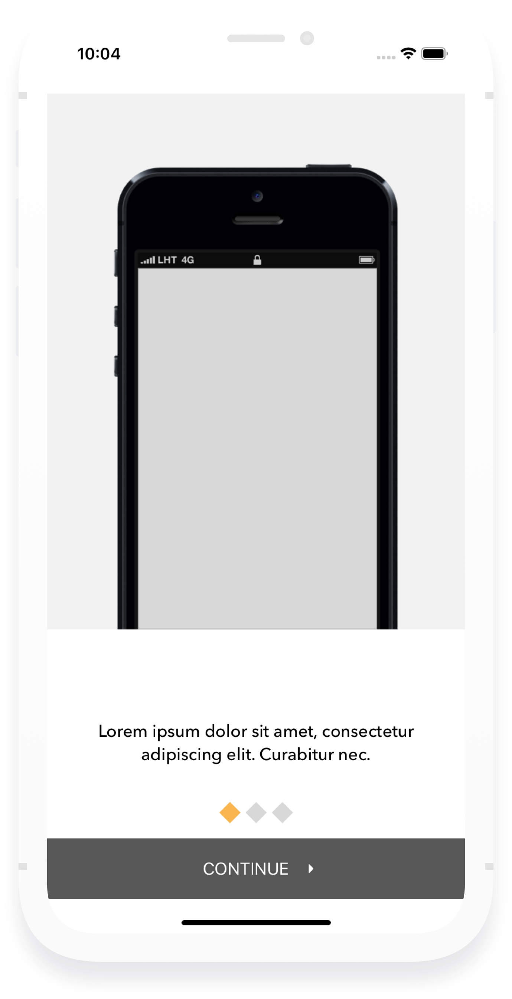

## Storex
 
  

an e-commerce iOS app that consume Turing e-commerce API 

 ### using:
 - [Moya](https://github.com/Moya/Moya)
 - [RxSwift](https://github.com/ReactiveX/RxSwift)
 - [RxCocoa](https://github.com/ReactiveX/RxSwift/tree/master/RxCocoa)
 - [NotificationBannerSwift](https://github.com/Daltron/NotificationBanner)
 - [SDWebImage](https://github.com/SDWebImage/SDWebImage)
 - [SideMenu](https://github.com/jonkykong/SideMenu)
 
 ### API:
 https://mobilebackend.turing.com/docs - has SSL Certificate Problem :( 
 
 https://backendapi.turing.com/docs/#/
 
 ### UI/UX:
 https://github.com/zandoan/turing-uiux

### Screenshots:

   

> images used from pexel.com 
